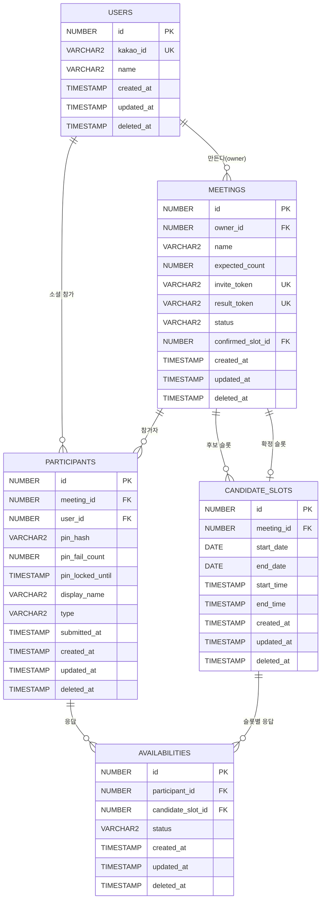

```mermaid
erDiagram
    USERS {
        NUMBER id PK
        VARCHAR2 kakao_id UK
        VARCHAR2 name
        TIMESTAMP created_at
        TIMESTAMP updated_at
        TIMESTAMP deleted_at
    }

    MEETINGS {
        NUMBER id PK
        NUMBER owner_id FK
        VARCHAR2 name
        NUMBER expected_count
        VARCHAR2 invite_token UK
        VARCHAR2 result_token UK
        VARCHAR2 status
        NUMBER confirmed_slot_id FK
        TIMESTAMP created_at
        TIMESTAMP updated_at
        TIMESTAMP deleted_at
    }

    CANDIDATE_SLOTS {
        NUMBER id PK
        NUMBER meeting_id FK
        DATE start_date
        DATE end_date
        TIMESTAMP start_time
        TIMESTAMP end_time
        TIMESTAMP created_at
        TIMESTAMP updated_at
        TIMESTAMP deleted_at
    }

    PARTICIPANTS {
        NUMBER id PK
        NUMBER meeting_id FK
        NUMBER user_id FK
        VARCHAR2 pin_hash
        NUMBER pin_fail_count
        TIMESTAMP pin_locked_until
        VARCHAR2 display_name
        VARCHAR2 type
        TIMESTAMP submitted_at
        TIMESTAMP created_at
        TIMESTAMP updated_at
        TIMESTAMP deleted_at
    }

    AVAILABILITIES {
        NUMBER id PK
        NUMBER participant_id FK
        NUMBER candidate_slot_id FK
        VARCHAR2 status
        TIMESTAMP created_at
        TIMESTAMP updated_at
        TIMESTAMP deleted_at
    }

    USERS ||--o{ MEETINGS : "만든다(owner)"
    USERS ||--o{ PARTICIPANTS : "소셜 참가"
    MEETINGS ||--o{ CANDIDATE_SLOTS : "후보 슬롯"
    MEETINGS ||--o{ PARTICIPANTS : "참가자"
    MEETINGS ||--o| CANDIDATE_SLOTS : "확정 슬롯"
    PARTICIPANTS ||--o{ AVAILABILITIES : "응답"
    CANDIDATE_SLOTS ||--o{ AVAILABILITIES : "슬롯별 응답"
```
