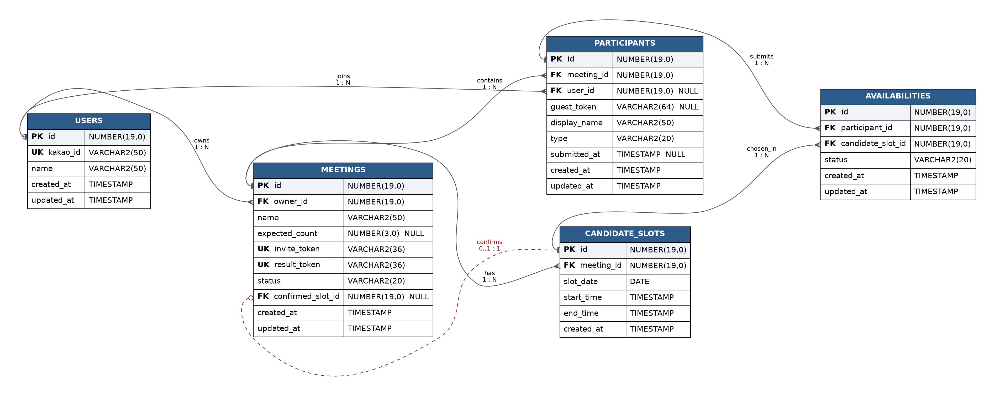

# Make-App 데이터베이스 설계 문서

> URL 기반 일정 조율 서비스의 데이터베이스 설계 명세서

## 1. 개요

### 서비스 한 줄 요약

초대 URL을 통해 모임 참여자들이 가능한 시간을 선택하면, 리더가 최적의 시간을 확정하는 일정 조율 서비스.

### 핵심 설계 원칙

- **소셜 사용자와 비회원 통합 관리**: 카카오 로그인 사용자(`USERS`)와 비회원을 모두 `PARTICIPANTS`에서 통합 처리
- **모임별 표시 이름 분리**: 동명이인 처리를 위해 `display_name`을 모임 단위로 관리
- **응답 완료 명시적 추적**: `submitted_at`으로 "응답 중"과 "응답 완료"를 구분
- **추천과 확정의 분리**: 알고리즘 추천 결과와 리더의 최종 결정을 별도 관리

### 사용 환경

- DB: Oracle
- ORM: Spring Data JPA (+ 필요시 QueryDSL)
- 채번 전략: Oracle Sequence + `@SequenceGenerator`

---

## 2. 테이블 개요

| #   | 테이블명          | 역할                      | 주요 컬럼                                             |
| --- | ----------------- | ------------------------- | ----------------------------------------------------- |
| 1   | `USERS`           | 카카오 로그인 사용자      | `kakao_id`, `name`                                    |
| 2   | `MEETINGS`        | 모임(약속) 본체           | `name`, `invite_token`, `status`, `confirmed_slot_id` |
| 3   | `CANDIDATE_SLOTS` | 후보 시간 슬롯            | `slot_date`, `start_time`, `end_time`                 |
| 4   | `PARTICIPANTS`    | 모임 참여자 (소셜+비회원) | `display_name`, `type`, `submitted_at`                |
| 5   | `AVAILABILITIES`  | 슬롯별 가능/불가능 응답   | `status`                                              |

---

## 3. ERD



---

## 4. 테이블 상세 명세

### 4.1 USERS

> 카카오로 로그인한 모든 사용자(리더 + 소셜 팔로워)를 저장. 비회원 팔로워는 이 테이블에 들어가지 않음.

| 컬럼         | 자료형       | NULL     | 키/제약 | 설명                                                     |
| ------------ | ------------ | -------- | ------- | -------------------------------------------------------- |
| `id`         | NUMBER(19,0) | NOT NULL | PK      | 시스템 내부 사용자 식별자. 시퀀스(`users_seq`) 채번      |
| `kakao_id`   | VARCHAR2(50) | NOT NULL | UNIQUE  | 카카오 OAuth 응답의 회원번호. 로그인 시 이 컬럼으로 조회 |
| `name`       | VARCHAR2(50) | NOT NULL |         | 카카오에서 받아온 사용자 이름                            |
| `created_at` | TIMESTAMP    | NOT NULL |         | 최초 가입 시각 (JPA `@CreatedDate`)                      |
| `updated_at` | TIMESTAMP    | NOT NULL |         | 마지막 수정 시각 (JPA `@LastModifiedDate`)               |

**비즈니스 규칙**

- 첫 로그인 시 자동 가입(JIT Provisioning) — 별도 회원가입 단계 없음
- 같은 카카오 계정 중복 가입 방지: `kakao_id` UNIQUE 제약

---

### 4.2 MEETINGS

> 모임(약속) 본체. 모임 메타 정보, 초대/결과 URL 토큰, 상태, 확정 결과까지 모두 포함.

| 컬럼                | 자료형       | NULL     | 키/제약                 | 설명                                                  |
| ------------------- | ------------ | -------- | ----------------------- | ----------------------------------------------------- |
| `id`                | NUMBER(19,0) | NOT NULL | PK                      | 모임 식별자                                           |
| `owner_id`          | NUMBER(19,0) | NOT NULL | FK → USERS.id           | 모임을 만든 리더의 사용자 ID. 리더 권한 검증의 기준   |
| `name`              | VARCHAR2(50) | NOT NULL |                         | 모임명                                                |
| `expected_count`    | NUMBER(3,0)  | NULL     |                         | 예상 참여 인원. 입력하지 않을 수 있음                 |
| `invite_token`      | VARCHAR2(36) | NOT NULL | UNIQUE                  | 초대 URL용 토큰. UUID v4                              |
| `result_token`      | VARCHAR2(36) | NOT NULL | UNIQUE                  | 결과 공유 URL용 토큰. 초대와 분리                     |
| `status`            | VARCHAR2(20) | NOT NULL |                         | 모임 상태: `DRAFT` / `OPEN` / `CONFIRMED` / `EXPIRED` |
| `confirmed_slot_id` | NUMBER(19,0) | NULL     | FK → CANDIDATE_SLOTS.id | 리더가 최종 확정한 슬롯. 확정 전엔 NULL               |
| `created_at`        | TIMESTAMP    | NOT NULL |                         | 모임 생성 시각                                        |
| `updated_at`        | TIMESTAMP    | NOT NULL |                         | 마지막 수정 시각                                      |

**상태 머신**

```
DRAFT ─── 모임 생성 중 (저장 전)
  ↓
OPEN ──── 응답 수집 중
  ↓
CONFIRMED ─ 리더가 최종 일정 확정 (confirmed_slot_id 채워짐)
  ↓
EXPIRED ── 만료됨
```

**비즈니스 규칙**

- `status = 'CONFIRMED'`일 때 반드시 `confirmed_slot_id IS NOT NULL`이어야 함
- 시간 슬롯 단위는 **30분 고정** (DB 컬럼 없이 코드 상수로 처리)
- `invite_token`과 `result_token`은 별도 토큰. 결과 URL로는 응답을 등록할 수 없음

---

### 4.3 CANDIDATE_SLOTS

> 리더가 모임 생성 시 등록한 후보 시간 슬롯들.

| 컬럼         | 자료형       | NULL     | 키/제약          | 설명                                 |
| ------------ | ------------ | -------- | ---------------- | ------------------------------------ |
| `id`         | NUMBER(19,0) | NOT NULL | PK               | 슬롯 식별자                          |
| `meeting_id` | NUMBER(19,0) | NOT NULL | FK → MEETINGS.id | 소속 모임                            |
| `slot_date`  | DATE         | NOT NULL |                  | 후보 날짜. JPA `LocalDate` 매핑      |
| `start_time` | TIMESTAMP    | NOT NULL |                  | 슬롯 시작 시각. JPA `LocalTime` 매핑 |
| `end_time`   | TIMESTAMP    | NOT NULL |                  | 슬롯 종료 시각                       |
| `created_at` | TIMESTAMP    | NOT NULL |                  | 생성 시각                            |

**추가 제약 (권장)**

- `(meeting_id, slot_date, start_time)` 복합 UNIQUE 인덱스 — 중복 슬롯 방지

**비즈니스 규칙**

- 슬롯은 30분 단위로 생성됨 (예: 09:00~09:30, 09:30~10:00...)
- Oracle에 순수 `TIME` 타입이 없어 `TIMESTAMP` 사용 (JPA `LocalTime`이 자동 변환)

---

### 4.4 PARTICIPANTS

> 모임 참여자. 리더, 소셜 팔로워, 비회원 팔로워가 모두 한 테이블에 통합.

| 컬럼           | 자료형       | NULL     | 키/제약          | 설명                                    |
| -------------- | ------------ | -------- | ---------------- | --------------------------------------- |
| `id`           | NUMBER(19,0) | NOT NULL | PK               | 참여자 식별자                           |
| `meeting_id`   | NUMBER(19,0) | NOT NULL | FK → MEETINGS.id | 소속 모임                               |
| `user_id`      | NUMBER(19,0) | NULL     | FK → USERS.id    | 소셜 로그인 시 채워짐                   |
| `guest_token`  | VARCHAR2(64) | NULL     |                  | 비회원 참여 시 채워짐. 재접속 식별용    |
| `display_name` | VARCHAR2(50) | NOT NULL |                  | 화면 표시 이름. 동명이인 처리 결과 반영 |
| `type`         | VARCHAR2(20) | NOT NULL |                  | 역할: `LEADER` / `MEMBER` / `GUEST`     |
| `submitted_at` | TIMESTAMP    | NULL     |                  | 응답 완료 시각. NULL이면 미응답/응답 중 |
| `created_at`   | TIMESTAMP    | NOT NULL |                  | 참여 등록 시각                          |
| `updated_at`   | TIMESTAMP    | NOT NULL |                  | 마지막 수정 시각                        |

**추가 제약 (필수)**

```sql
-- user_id와 guest_token 중 정확히 하나만 채워져야 함
CHECK ((user_id IS NOT NULL AND guest_token IS NULL)
    OR (user_id IS NULL AND guest_token IS NOT NULL))

-- 같은 모임에 같은 소셜 사용자 중복 참여 방지
UNIQUE (meeting_id, user_id)

-- 같은 모임에 같은 게스트 토큰 중복 참여 방지
UNIQUE (meeting_id, guest_token)
```

**비즈니스 규칙**

- `LEADER` 타입: 모임을 만든 리더 자신이 응답을 남길 때 (`meetings.owner_id`와 동일인)
- `MEMBER` 타입: 카카오 로그인으로 참여한 팔로워
- `GUEST` 타입: 비회원으로 참여한 팔로워 (`guest_token`만 가짐)
- `display_name`은 동명이인이 있을 때 `김민수 (2)` 식으로 접미사가 붙음
- `submitted_at`이 NULL이면 "응답 미완료", 값이 있으면 "응답 완료". FR-046/066 처리의 기준

---

### 4.5 AVAILABILITIES

> 각 참여자가 각 슬롯에 대해 가능/불가능을 표시한 응답.

| 컬럼                | 자료형       | NULL     | 키/제약                 | 설명                                   |
| ------------------- | ------------ | -------- | ----------------------- | -------------------------------------- |
| `id`                | NUMBER(19,0) | NOT NULL | PK                      | 응답 식별자                            |
| `participant_id`    | NUMBER(19,0) | NOT NULL | FK → PARTICIPANTS.id    | 응답한 참여자                          |
| `candidate_slot_id` | NUMBER(19,0) | NOT NULL | FK → CANDIDATE_SLOTS.id | 응답 대상 슬롯                         |
| `status`            | VARCHAR2(20) | NOT NULL |                         | 응답 상태: `AVAILABLE` / `UNAVAILABLE` |
| `created_at`        | TIMESTAMP    | NOT NULL |                         | 최초 응답 시각                         |
| `updated_at`        | TIMESTAMP    | NOT NULL |                         | 마지막 수정 시각                       |

**추가 제약 (필수)**

```sql
-- 한 참여자가 같은 슬롯에 응답을 두 번 남길 수 없음 (동시성 충돌 방지)
UNIQUE (participant_id, candidate_slot_id)
```

**비즈니스 규칙**

- "응답하지 않음"은 행이 존재하지 않는 것으로 처리 (`AVAILABLE`/`UNAVAILABLE`만 저장)
- 본인 응답만 수정 가능: 서비스 단에서 `participant.id == 로그인 participantId` 검증

---

## 5. 테이블 관계

| 관계                              | 카디널리티 | 의미                                      |
| --------------------------------- | ---------- | ----------------------------------------- |
| USERS → MEETINGS                  | 1 : N      | 한 사용자가 여러 모임의 리더가 될 수 있음 |
| USERS → PARTICIPANTS              | 1 : N      | 한 사용자가 여러 모임에 참여 가능         |
| MEETINGS → CANDIDATE_SLOTS        | 1 : N      | 한 모임이 여러 후보 슬롯을 가짐           |
| MEETINGS → PARTICIPANTS           | 1 : N      | 한 모임에 여러 참여자                     |
| MEETINGS → CANDIDATE_SLOTS (확정) | 0..1 : 1   | 한 모임은 최대 한 슬롯을 확정             |
| PARTICIPANTS → AVAILABILITIES     | 1 : N      | 한 참여자가 여러 슬롯에 응답              |
| CANDIDATE_SLOTS → AVAILABILITIES  | 1 : N      | 한 슬롯에 여러 참여자의 응답              |

`AVAILABILITIES`는 PARTICIPANTS와 CANDIDATE_SLOTS 사이의 다대다(N:M) 관계를 풀어주는 연결 테이블이면서 `status` 컬럼을 함께 가지는 구조(associative entity).

---

## 6. 핵심 비즈니스 규칙

### 6.1 동명이인 처리

같은 모임에 같은 이름이 등록되면 입력 시점에 접미사 부여하여 저장.

```
1번째 "김민수" 등록 → display_name = "김민수"
2번째 "김민수" 등록 → display_name = "김민수 (2)"
3번째 "김민수" 등록 → display_name = "김민수 (3)"
```

`USERS.name`은 카카오 원본값 유지, `PARTICIPANTS.display_name`은 모임별 표시 이름.

### 6.2 참여자 식별 (소셜 vs 비회원)

| 구분                 | user_id | guest_token | type     |
| -------------------- | ------- | ----------- | -------- |
| 카카오 로그인 리더   | 채워짐  | NULL        | `LEADER` |
| 카카오 로그인 팔로워 | 채워짐  | NULL        | `MEMBER` |
| 비회원 팔로워        | NULL    | 채워짐      | `GUEST`  |

CHECK 제약으로 두 값 중 정확히 하나만 채워지도록 강제.

### 6.3 응답 완료 추적

- `PARTICIPANTS.submitted_at = NULL` → 아직 응답 중 또는 미응답
- `PARTICIPANTS.submitted_at != NULL` → 응답 완료

전원 응답 완료 판단:

```sql
SELECT COUNT(*) FROM participants
 WHERE meeting_id = :meetingId AND submitted_at IS NULL;
-- 결과가 0이면 모두 응답 완료 → 알림 발송
```

### 6.4 모임 확정 흐름

1. 리더가 결과 화면에서 슬롯 하나를 선택하고 "확정" 버튼 클릭
2. 권한 검증: `meeting.owner_id == 로그인 user.id`
3. `meetings.confirmed_slot_id = 선택된 slot.id`, `meetings.status = 'CONFIRMED'` 업데이트
4. 결과 URL 접속 시 분기:
   - `confirmed_slot_id IS NULL` → 추천 결과 화면 (가능 인원 정렬)
   - `confirmed_slot_id IS NOT NULL` → 확정 일정 화면

---

## 7. 인덱스 전략 (권장)

| 테이블          | 인덱스                                     | 목적                                       |
| --------------- | ------------------------------------------ | ------------------------------------------ |
| USERS           | `kakao_id` (UK)                            | 로그인 시 사용자 조회                      |
| MEETINGS        | `invite_token` (UK)                        | 초대 URL 접속 시 모임 조회                 |
| MEETINGS        | `result_token` (UK)                        | 결과 URL 접속 시 모임 조회                 |
| MEETINGS        | `owner_id`                                 | 마이페이지에서 내가 만든 모임 조회         |
| CANDIDATE_SLOTS | `meeting_id`                               | 모임의 모든 슬롯 조회                      |
| CANDIDATE_SLOTS | `(meeting_id, slot_date, start_time)` (UK) | 중복 방지 + 정렬                           |
| PARTICIPANTS    | `meeting_id`                               | 모임의 참여자 조회                         |
| PARTICIPANTS    | `(meeting_id, user_id)` (UK)               | 중복 참여 방지                             |
| PARTICIPANTS    | `(meeting_id, guest_token)` (UK)           | 비회원 재접속 식별                         |
| AVAILABILITIES  | `candidate_slot_id`                        | 시간대별 가능 인원 집계 (가장 빈번한 쿼리) |
| AVAILABILITIES  | `(participant_id, candidate_slot_id)` (UK) | 중복 응답 방지                             |

---

## 8. 주요 쿼리 예시

### 8.1 시간대별 가능/불가능 인원 집계 (결과 화면)

```sql
SELECT cs.id, cs.slot_date, cs.start_time, cs.end_time,
       COUNT(CASE WHEN a.status = 'AVAILABLE'   THEN 1 END) AS yes_count,
       COUNT(CASE WHEN a.status = 'UNAVAILABLE' THEN 1 END) AS no_count
  FROM candidate_slots cs
  LEFT JOIN availabilities a ON a.candidate_slot_id = cs.id
 WHERE cs.meeting_id = :meetingId
 GROUP BY cs.id, cs.slot_date, cs.start_time, cs.end_time
 ORDER BY yes_count DESC, cs.slot_date, cs.start_time;
```

### 8.2 전원 응답 완료 여부 확인

```sql
SELECT COUNT(*) AS pending
  FROM participants
 WHERE meeting_id = :meetingId
   AND submitted_at IS NULL;
```

### 8.3 내가 만든 모임 목록 (마이페이지)

```sql
SELECT m.id, m.name, m.status, m.created_at
  FROM meetings m
 WHERE m.owner_id = :userId
 ORDER BY m.created_at DESC;
```

---

## 9. Oracle 자료형 참고

| Java 타입                    | Oracle 타입     | 비고                                      |
| ---------------------------- | --------------- | ----------------------------------------- |
| `Long`                       | `NUMBER(19, 0)` | 모든 ID 컬럼                              |
| `Integer`                    | `NUMBER(10, 0)` |                                           |
| `Short` (소형 정수)          | `NUMBER(3, 0)`  | `expected_count` 등                       |
| `String`                     | `VARCHAR2(N)`   | 가변 길이 문자열                          |
| `LocalDate`                  | `DATE`          | 날짜만                                    |
| `LocalDateTime`              | `TIMESTAMP`     | 날짜+시간                                 |
| `LocalTime`                  | `TIMESTAMP`     | Oracle엔 `TIME` 없음. Hibernate 자동 변환 |
| Enum (`@Enumerated(STRING)`) | `VARCHAR2(20)`  | `status`, `type` 등                       |

> Oracle에는 `BIGINT`나 `DATETIME` 같은 타입이 없음. `NUMBER`와 `TIMESTAMP`로 통일.

---

## 10. 변경 이력

| 버전 | 날짜       | 변경 내용                                                                   |
| ---- | ---------- | --------------------------------------------------------------------------- |
| v1   | 2026-05-19 | 초기 ERD 설계 (5개 테이블)                                                  |
| v2   | 2026-05-20 | `MEETINGS.time_unit_min` 제거 (30분 고정), `PARTICIPANTS.submitted_at` 추가 |
